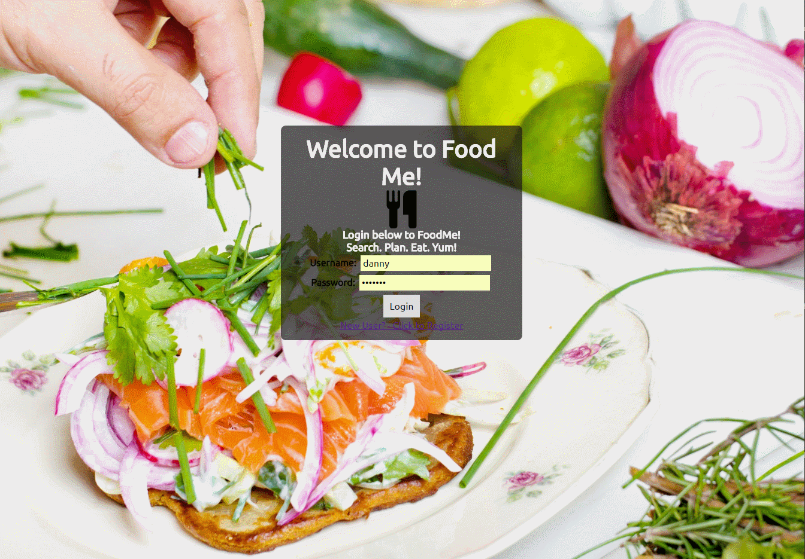

# FoodMe!

##Overwhelmed by all your recipes and can't plan your meals for the week?  Have no fear, foodMe is here!  Search recipe/food data from Yummly, create custom meal plans, drag and drop your recipes onto your planning page.

## Interactive SPA using mongoDB/mongoose, express, JavaScript (some ES6), jQuery, Node.js, bcrypt, nodemailer. Thx to [Jquery Touch Punch](http://touchpunch.furf.com/) for allowing this to even work on mobile!

## App Features:
* Hashed passwords and secure login
* Interactive SPA
* Drag and drop "Trello" style Interface
* Order and arrange your menu according to your schedule
* Search the Yummly API for recipes or by a food type
* Save recipes to your "Faves"

## Rest API
* Login user - /login (uname, hashed password) - auth required
* Create new user - /users/create (username, password, email)
* Add menu item to user - /update (database object)
* Remove menu item from user - /remove (database object)
* Display user's menu - /menu (id)
* Delete user - /delete (id) - auth required

## Upcoming Features:
* Weekly mail of your upcoming menu, including ingredient lists for your shopping trip!
* Ordering of cards on your menu
* Update and edit your username/email address
* Enter your own recipes!

## Screenshots

Using the app - Drag and Drop Recipes

Home Page

App Main Page

Searches and Favorites

### Questions? Contact danjenner@gmail.com. No commercial use, but feel free to have fun!
